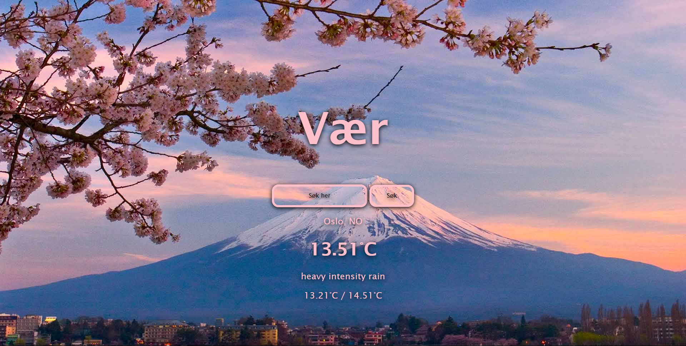

<h1 align="center">CSS FlexBox</h1>
<div align="center">
  <h3>
    <a href="https://github.com/roykenvgs/test">
      Lenken til prosjektet
    </a>
  </h3>
</div>
<!-- TABLE OF CONTENTS -->

## Table of Contents

- [Overview](#overview)
- [Built With](#built-with)
- [Features](#features)
- [How to use](#how-to-use)
- [Contact](#contact)

<!-- OVERVIEW -->
## Overview
Se nederst

### Built With
- [HTML](https://www.w3schools.com/html/)
- [CSS](https://www.w3schools.com/css/default.asp)
- [JS]
- [API]

## Features
Denne nettsiden bruker api og har følgene egenskaper
- vise grader
- søke funksjon 
- enter for å søke
- rolig design

## How To Use
Hvilke koder har du brukt? Skrive her:

```
HTML 
- div
- h1
- input
- button
CSS 
- margin
- color
- border
- text shadow
JS
- function
- DOM

```

## Contact
- GitHub [ShaneMM](https://github.com/roykenvgs)
- Epost [Shane Mumford](shaneskole07@gmail.com)


## Happy coding!

## Forventet resultat


